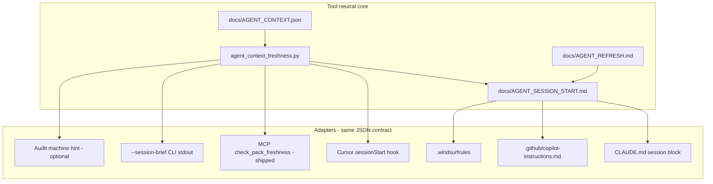

# Agent freshness adapter — Phase D plan (WQ-308)

**Status:** Phase D1–D2 shipped (engine 2.22.30) · **D3 next** (Claude/Copilot/Windsurf adapter paragraphs) · Plan: `docs/AGENT_FRESHNESS_ADAPTER_PLAN.md`
**Last updated:** 2026-08-30  
**Builds on:** Phases A–C (WQ-306, WQ-301, WQ-307) — schema v2, `agent_context_freshness.py`, MCP, `Update-AgentStack.cmd`

| | |
|---|---|
| **Work queue** | WQ-308 (parked) |
| **Upgrade path** | `docs/AGENT_UPGRADE_PATH.md` § Phase D |
| **Single source of truth** | `pack/scripts/agent_context_freshness.py` + `docs/AGENT_CONTEXT.json` (no second freshness logic) |

---

## Goal

When an agent session **starts** (or the user opens a project), automatically answer:

1. Is this project’s agent context **stale**?
2. If yes — what should the agent **re-read** and what **handshake** should it report?
3. If no — stay **silent** (no noise every chat).

**Cursor gets the deepest integration** (native `sessionStart` hooks). **Every other tool** gets the same facts through files, MCP, and adapter instructions — widen the net without forking logic.

---

## Problem today

| Method | Works? | Friction |
|--------|--------|----------|
| Paste `docs/AGENT_PASTE.txt` | Yes | Manual every stale chat |
| Trigger phrase (*refresh pack context*) | Yes | User must remember; rules must load |
| MCP `check_pack_freshness` | Yes | Cursor/Claude with MCP; agent must call it |
| Audit Improve line | Yes | Only during audit runs |
| `Update-AgentStack.cmd` | Yes | Disk sync; does not reach **already-open** chats |

Open chats **never hot-reload**. Phase D reduces “forgot to paste” failures at **session boundary** — the one moment every tool has in common.

---

## Architecture



**Rule:** Adapters call the core (Python or a thin PowerShell wrapper). They do **not** re-implement stamp comparison.

---

## Shared artifacts (new + existing)

| File | Role |
|------|------|
| `docs/AGENT_CONTEXT.json` | Existing — stamp, `requiredReads`, `triggerPhrases`, `handshake` |
| `docs/AGENT_REFRESH.md` | Existing — full brief after refresh |
| `docs/AGENT_PASTE.txt` | Existing — one-line paste |
| **`docs/AGENT_SESSION_START.md`** | **New** — ≤40 lines: stale/fresh verdict, required reads, handshake line, link to `AGENT_REFRESH.md` if stale |
| **`pack/scripts/invoke-agent-freshness.ps1`** | **New** — resolves project root, calls Python, writes/returns session brief; used by hooks and bootstrap |

### `AGENT_SESSION_START.md` (universal net)

Written or updated whenever:

- `refresh-agent-context.ps1` runs (always refresh content), **and/or**
- Any adapter asks for `--write-session-start`

**Stale example (abbreviated):**

```markdown
# Agent session start

**Context: STALE** — re-read before substantial work.

| Check | Value |
|-------|-------|
| Stamped engine | 2.22.25 |
| Installed engine | 2.22.28 |
| Reason | stamped 2.22.25, installed engine 2.22.28 |

**Required reads (absolute paths):**
- C:\...\project\AGENTS.md
- C:\...\project\docs\AGENT_REFRESH.md
- …

**Handshake:** Reply with pack version and audit engine version from files you read.

**Remediation:** Run `Update-AgentStack.cmd "C:\...\project"` or offer to run `Refresh-AgentContext.cmd`.
```

**Fresh example:**

```markdown
# Agent session start

**Context: OK** (engine 2.22.28). No mandatory re-read this session.
Optional: `docs/WORK_QUEUE.md` if prioritizing work.
```

This file is the **widest net** — any agent that can read project files gets the same story without Cursor.

---

## Python core extensions

Extend `agent_context_freshness.py` (behavior step 35 already covers self-test):

| Flag | Output |
|------|--------|
| `--check` | Existing JSON freshness |
| `--brief` | Existing refresh body + freshness |
| **`--session-brief`** | **New** — JSON for hooks: `{ stale, openerLine, markdownPath, requiredReads[], handshake, permission }` |
| **`--write-session-start`** | **New** — write `docs/AGENT_SESSION_START.md` under canonical root; idempotent |

`openerLine` — single ASCII line for clipboard / hook injection (like `AGENT_PASTE.txt` but dynamic).

---

## Phase D1 — Core + universal file [required] ☑ (engine 2.22.29)

| Step | Deliverable | Status |
|------|-------------|--------|
| D1a | `--session-brief` + `--write-session-start` in `agent_context_freshness.py` | ☑ |
| D1b | `invoke-agent-freshness.ps1` wrapper | ☑ |
| D1c | `refresh-agent-context.ps1` calls `--write-session-start` after stamp | ☑ |
| D1d | gitignore snippet tracks `AGENT_SESSION_START.md` | ☑ |
| D1e | `AI_INSTRUCTIONS.md.template` + `AGENTS.md.template` session-start read | ☑ |
| D1f | `docs/AGENT_UPGRADE_PATH.md` step 3 table | ☑ |
| D1g | Behavior **step 38** | ☑ |

**Done when:** Any tool following `AI_INSTRUCTIONS.md` gets stale/fresh at session start via file alone.

---

## Phase D2 — Cursor `sessionStart` hook [required for WQ-308] ☑ (engine 2.22.30)

| Step | Deliverable | Status |
|------|-------------|--------|
| D2a | Cursor `sessionStart` contract (`additional_context`) | ☑ |
| D2b | `pack/templates/cursor/hooks/session-freshness.ps1` | ☑ |
| D2c | `pack/templates/cursor/hooks.json.template` | ☑ |
| D2d | Bootstrap `-Targets Cursor` / `All` | ☑ |
| D2e | `install.ps1 -InstallSessionHooks` (opt-in user hook) | ☑ |
| D2f | Behavior step 38 hook smoke | ☑ |

### Hook behavior (defaults)

| Setting | Default | Rationale |
|---------|---------|-----------|
| **failClosed** | `false` | Hook crash must not block Cursor sessions |
| **Stale** | Inject `openerLine` + pointer to `AGENT_SESSION_START.md` | Agent sees it before first reply |
| **Fresh** | Empty or one-line OK | Avoid nagging |
| **Wrong workspace root** | Warn if `workspaceMatchesCanonical: false` | Common BSOD/parent-folder mistake |
| **Pack repo** | Shorter brief (maintainer mode) | Less noise on pack self-work |

### Optional Cursor extras (same phase or D2 appendix)

| Hook | Purpose |
|------|---------|
| `beforeSubmitPrompt` + matcher | If context stale and prompt looks like “implement/audit/build”, prepend one-line reminder — **off by default** (noise) |
| `sessionEnd` | No-op log to `.cursor/hooks/session-freshness.log` for debugging — **optional** |

---

## Phase D3 — Wider adapter net [required for “widest practical coverage”]

| Tool | Adapter | Mechanism |
|------|---------|-----------|
| **Any file-based agent** | `AGENT_SESSION_START.md` + template instructions | D1 |
| **Claude Desktop** | `CLAUDE.md` block | “Session start: read `docs/AGENT_SESSION_START.md`; MCP `check_pack_freshness` available” |
| **GitHub Copilot** | `.github/copilot-instructions.md` | Same session-start paragraph |
| **Windsurf** | `.windsurfrules` | Same |
| **Portable** | `AI_INSTRUCTIONS.md` + `GENERIC_RULES.md` export | `sync-portable-docs.ps1` includes session-start instruction |
| **MCP** | Already shipped | Document as peer to hooks in upgrade path |
| **CLI / scripts** | `invoke-agent-freshness.ps1 -PrintOpener` | For humans scripting opens |
| **Register adapters** | `register-tool-adapters.ps1 -Repair` | Ensures session-start paragraph present in Claude/Copilot/Windsurf files |
| **Verify setup** | `verify-agent-setup.ps1` | Check `AGENT_SESSION_START.md` exists after refresh; adapter paragraphs present |

### Phase D3 optional (appendix — implement only if D1–D3 stable)

| Item | Notes |
|------|-------|
| Audit machine **Improve** “session-start file older than stamp” | Only if file missing when context exists |
| VS Code **tasks.json** template | Task “Open agent session brief” — niche |
| **`sessionStart` user hook without `-InstallSessionHooks`** | Document manual copy from `pack/templates/cursor/` |

---

## Install and bootstrap matrix

| Entry point | What it does |
|-------------|--------------|
| `Refresh-AgentContext.cmd` | Refreshes stamp + **`AGENT_SESSION_START.md`** |
| `Update-AgentStack.cmd` | Same + install option |
| `bootstrap-project.ps1 -Targets Cursor` | Project `.cursor/hooks/` |
| `bootstrap-project.ps1 -Targets All` | Hooks + all adapter files |
| `bootstrap-project.ps1 -Targets Portable` | Session-start **file + instructions only** (no hooks) |
| `install.ps1 -InstallSessionHooks` | User-global Cursor hook (opt-in) |
| `register-tool-adapters.ps1 -Repair` | Non-Cursor session-start paragraphs |

**Default for existing projects:** refresh once → get `AGENT_SESSION_START.md`; Cursor projects opt into hooks via bootstrap repair or manual copy.

---

## UX and noise control

1. **Fresh context** — hook returns `{}` or minimal “OK” (no required reads listed again).
2. **Stale context** — one screenful max in injected text; details in `AGENT_SESSION_START.md`.
3. **Never auto-run refresh** — adapter **informs**; agent offers to run `Refresh-AgentContext.cmd` (per `agent-defaults-always.mdc`).
4. **Rate limit** — same stale state: identical brief until stamp changes (hash `AGENT_CONTEXT.json` syncedAt).
5. **Substantial work** — stale + user jumps straight to “implement Phase X” → optional `beforeSubmitPrompt` nudge (off by default).

---

## Verification

| Gate | Step |
|------|------|
| Python self-test extended | 35 (+ session-brief cases) |
| Session file + hook smoke | **38** (new) |
| Portable adapter paragraphs | 34 (+ session-start cite) |
| `verify-agent-setup.ps1` | session-start file check |
| `doctor.ps1` | optional: user hook registered when `-InstallSessionHooks` |

---

## Files touched (implementation estimate)

| Area | Files |
|------|-------|
| Core | `agent_context_freshness.py`, `invoke-agent-freshness.ps1` |
| Refresh | `refresh-agent-context.ps1` |
| Templates | `AGENT_SESSION_START.md.template`, `hooks.json.template`, `session-freshness.ps1`, `AI_INSTRUCTIONS.md.template`, `CLAUDE.md.template`, copilot/windsurf templates |
| Bootstrap / install | `bootstrap-project.ps1`, `install.ps1`, `register-tool-adapters.ps1` |
| Docs | `AGENT_UPGRADE_PATH.md`, `PORTABLE_SETUP.md`, `PACK_MAINTENANCE.md` |
| Verify | `verify-audit-behavior.ps1`, `verify-agent-setup.ps1`, `verify-portable-bootstrap.ps1` |
| Manifest | `pack/audit/manifest.json` + changelog bump |

---

## Out of scope

- Auto-running refresh without user/agent approval
- Replacing MCP or paste line (they remain peers)
- WQ-302 multi-agent mailbox
- Hot-reloading mid-session (Cursor limitation)
- Non-Windows hook runners (Windows-only pack; hooks use PowerShell)

---

## Promotion to build

1. User moves **WQ-308** from Parked → Active (or new WQ-309 split if D1 ships separately).
2. Handoff: `docs/handoffs/active/HANDOFF_WQ308_freshness_adapter.md` with **Implement Phase D1 only** (phased rule).
3. Bump audit engine when scripts ship; behavior step 38 before claiming done.

---

## Suggested implementation order

```
D1 (core + AGENT_SESSION_START.md)  →  widest net immediately
    →  D2 (Cursor sessionStart hook)  →  best UX in Cursor
        →  D3 (adapter repair + verify)  →  Claude/Copilot/Windsurf parity
            →  D2 optional hooks (beforeSubmitPrompt)  →  only if noise acceptable
```

**Estimated size:** D1 small · D2 medium (hook contract spike) · D3 small · optional hooks tiny.

---

## Cross-references

| Doc | Topic |
|-----|-------|
| `docs/AGENT_UPGRADE_PATH.md` | Phases A–D |
| `docs/MULTI_TOOL_GAP_PLAN.md` | Editor parity |
| `docs/PORTABLE_SETUP.md` | Non-Cursor session start |
| `pack/docs/PACK_MAINTENANCE.md` | Install/sync |
| `docs/WORK_QUEUE.md` | WQ-308 |
